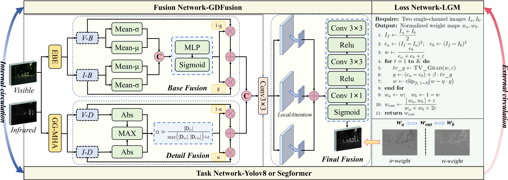

# TOMIFF: Task-Oriented Meta-Learning Framework for Multimodal Image Fusion with Adaptive Loss

## Abstract
Conventional image-fusion methods largely rely on static perception-oriented loss functions, making them ill-suited to downstream tasks such as object detection. Conversely, task-driven strategies can boost detection accuracy but often sacrifice human-perceived visual quality. To bridge this gap, we propose TOMIFF, a lightweight meta-learning framework that forms a closed loop among the fusion, loss and task networks to jointly enhance fusion quality and task performance. The fusion network builds a global basis in a multi-scale wavelet domain, extracts orientation-sensitive high-frequency details via Gabor-guided multi-head attention, and employs a progressive strategy that couples correlation-gated base fusion with pixel-level detail fusion to preserve structure and enrich details. The loss network contains only four learnable scalars and generates pixel-wise dual weights during training to provide adaptive supervision. A downstream detection/segmentation head returns semantic gradients to the fusion backbone, completing the feedback loop. These three components are alternately optimized through a bi-level inner–outer meta-learning scheme with epoch-level re-weighting, dynamically aligning visual fidelity with task objectives while enabling stable training and effortless task transfer. Extensive experiments on four public benchmarks show that TOMIFF surpasses state-of-the-art methods in both objective and subjective fusion metrics, significantly raises detection mAP and segmentation mIoU, and retains a clear lead in cross-dataset evaluations. With just 0.12 M parameters and about 60 GFLOPs of inference cost, the model delivers an excellent balance of efficiency and accuracy, demonstrating strong deployability and generalization potential.

### ⚙ Network Architecture

**The complete implementation code, including training scripts and loss functions, will be made publicly available after the paper is published. Currently, we only provide the basic framework and test code for reference.**

### 🏊 Training
**1. Virtual Environment**
```
- Python 3.7+
- PyTorch 1.8.1
- CUDA 11.1 (for GPU support)

### Dependencies

```bash
torch==1.8.1+cu111
torchvision==0.9.1+cu111
torchaudio==0.8.1
numpy==1.21.5
opencv-python==4.5.3.56
scikit-learn==1.1.3
scikit-image==0.19.2
scipy==1.7.3
kornia==0.2.0
matplotlib==3.7.5
tqdm==4.66.4
```

**2. Data Preparation**

Download the MSRS dataset from [this link](https://github.com/Linfeng-Tang/MSRS) and place it in the folder ``'.data/MSRS_train/'``.<br>
Download the FMB dataset from [this link](https://github.com/JinyuanLiu-CV/SegMiF) and place it in the folder ``'.data/FMB_train/'``.<br>
Download the M3FD dataset from [this link](https://github.com/JinyuanLiu-CV/TarDAL) and place it in the folder ``'.data/M3FD_train/'``.<br>
Download the LLVIP dataset from [this link](https://github.com/bupt-ai-cz/LLVIP) and place it in the folder ``'.data/LLVIP_train/'``.


**3. SFDFuse Training**

Run 
1.raining:
```bash
python train.py 
```

### 🏄 Testing

**1. Pretrained models**

Pretrained models are available in ``'./models/MSRS.pth'`` and ``'./models/FMB.pth'``....., which are responsible for the Infrared-Visible Fusion 

**2. Test datasets**

The test datasets used in the paper have been stored in ``'./test_img/MSRS'``, ``'./test_img/FMB'``.... for IVF


**3. Results in Our Paper**

If you want to infer with our TOMIFF and obtain the fusion results in our paper, please run 
```
python test_fuse.py
``` 
```
which can match the results in Table 1,2 in our original paper.

## 🙌 TOMIFF

### Illustration of our Frame model.

<div align="center">
    
</div>

### Qualitative fusion results.

#### MSRS & FMB Dataset Results
<div align="center">
    
</div>

#### M3FD & LLVIP Scene Results
<div align="center">
    
</div>

## 📝 Citation
Coming soon after publication.

## 📧 Contact
For any questions about the implementation, please feel free to open an issue.

